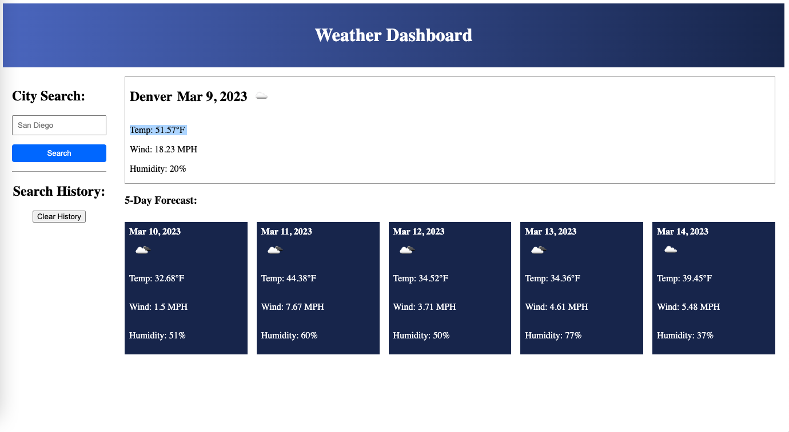

# Server-Side APIs Challenge: Weather Dashboard

This project task is to build a weather dashboard that will run in the browser and feature dynamically updated HTML and CSS.

The web appplication provides the user a choice to search any city in the US. Doing so will provide the user a 5 day weather forecast consisting of the projected high temp, wind speed and humidity for that day at noon. The web application queries the website openweathermap.org via their pubicly accessable API. Once the data is aquired via JQuery's $.get() function, the html and css dynamically updates to display the newly aquired data.

Each time when the user searches for a new city, their city search is saved to LocalStorage. It is added to a list blow the search input box as a button. Each button added will allow the user to re-search that same city by a simple click. The user may clear the search results by clicking on the "Clear History" button.

The default city data displayed is Denver. This will display on the web apps first page load.

The web application utilizes JQuery and DayJS.

[Link to working example](https://xclusive36.github.io/WeatherDashboard/)
